## Overview

[HubSpot](https://developers.hubspot.com) is an AI-powered customer relationship management (CRM) platform.

The `hubspot.crm.extensions.videoconferencing` offers APIs to connect and interact with the [HubSpot Video Conferencing Extension's API](https://developers.hubspot.com/docs/reference/api/crm/extensions/video-conferencing) endpoints, specifically based on the [HubSpot REST API](https://developers.hubspot.com/docs/reference/api).

## Setup guide

If you have an account already, go to the [HubSpot developer portal](https://app.hubspot.com/)

If you don't have a HubSpot Developer Account you can sign up to a free account [here](https://developers.hubspot.com/get-started)

### Step 1: Create/Login to a HubSpot Developer Account

If you have an account already, go to the [HubSpot developer portal](https://app.hubspot.com/)

If you don't have a HubSpot Developer Account you can sign up to a free account [here](https://developers.hubspot.com/get-started)

### Step 2 (Optional): Create a Developer Test Account under your account

Within app developer accounts, you can create [developer test accounts](https://developers.hubspot.com/docs/getting-started/account-types#developer-test-accounts) to test apps and integrations without affecting any real HubSpot data.

**Note: These accounts are only for development and testing purposes. In production you should not use Developer Test Accounts.**

1. Go to Test Account section from the left sidebar.
   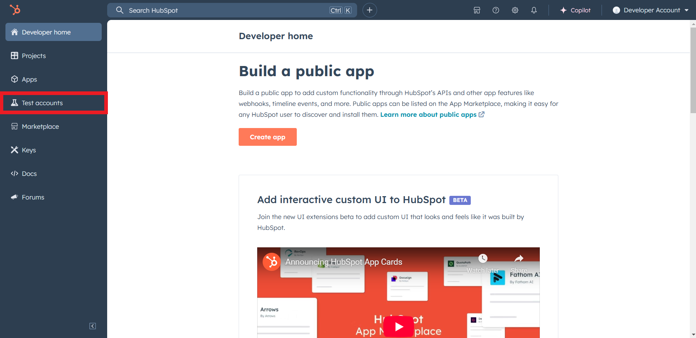

2. Click Create developer test account.
   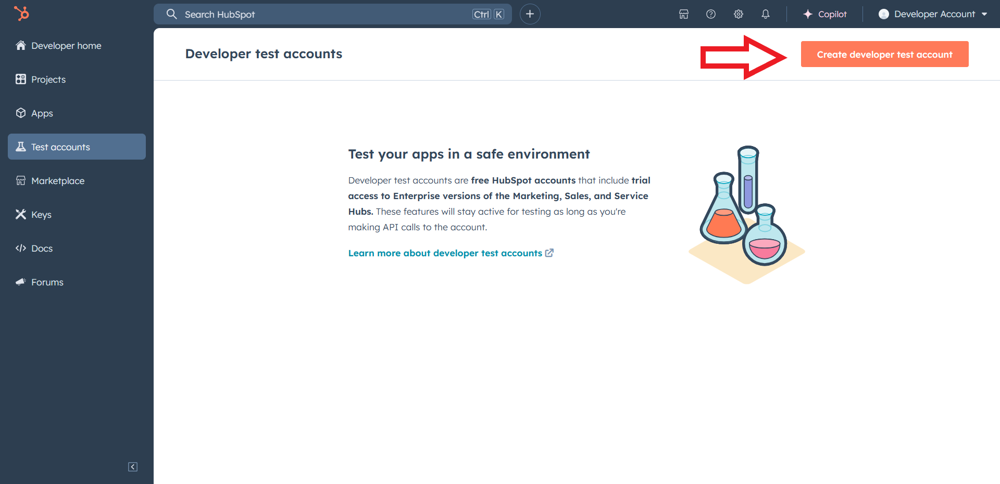

3. In the dialogue box, give a name to your test account and click create.
   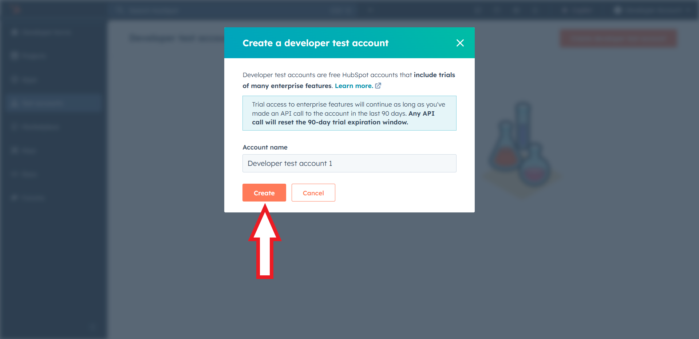

### Step 3: Create a HubSpot App under your account

1. In your developer account, navigate to the "Apps" section. Click on "Create App"
   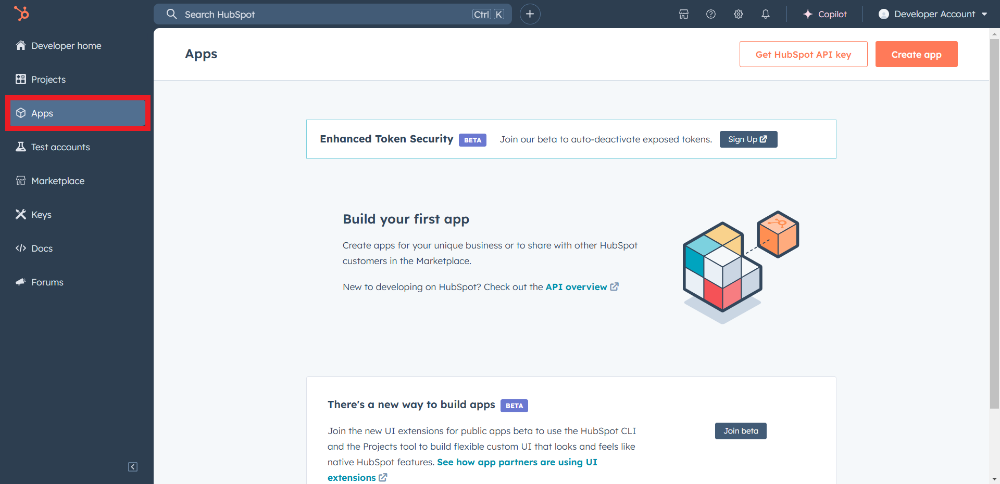

2. Provide the required app name and optionally a description.
   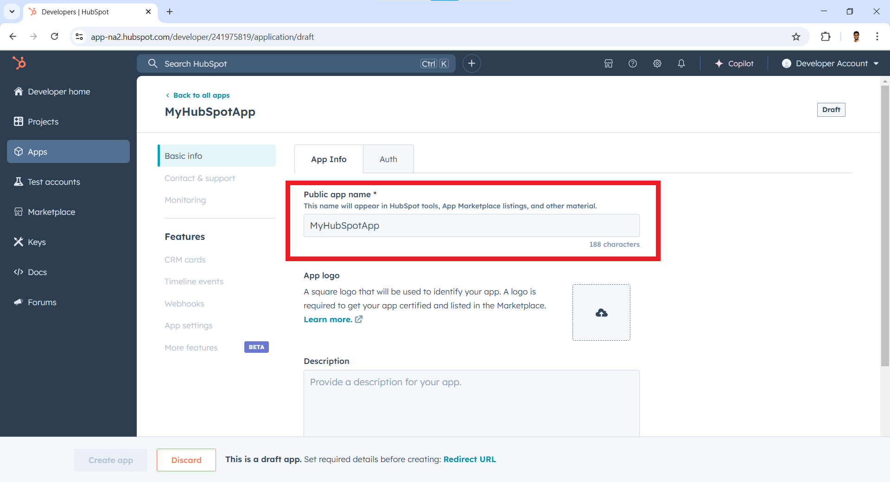

### Step 4: Set Redirect URL

1. Move to the "Auth" Tab.
   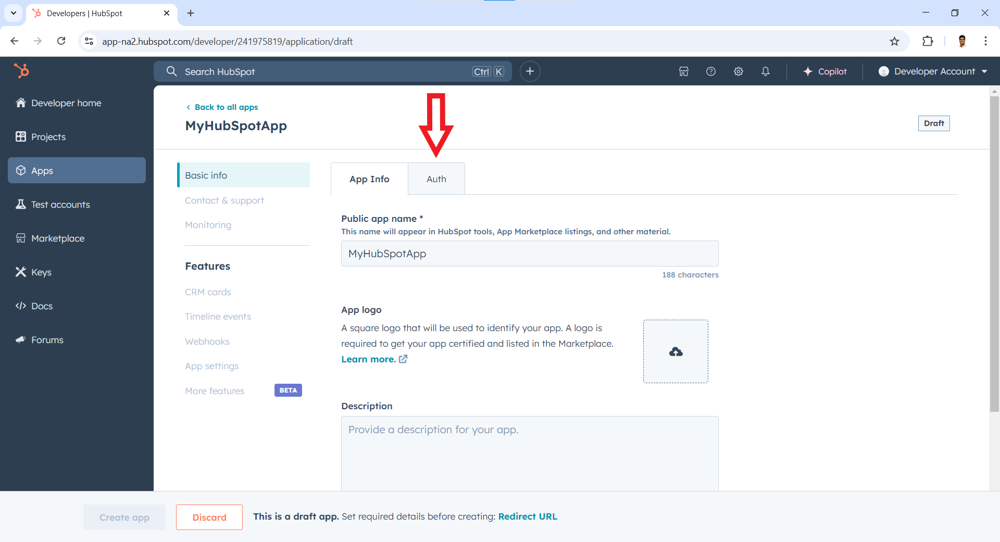

2. Add your "Redirect URI" in the relevant section. You can also use localhost addresses for local development purposes. Click Create App.
   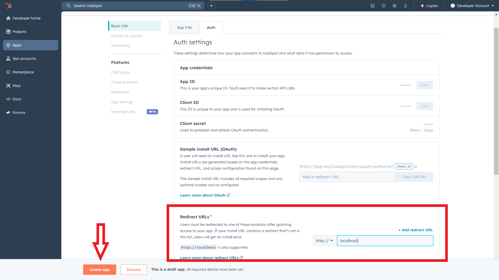

### Step 5: Get your App ID

1. Navigate to the "Apps" section, again.
  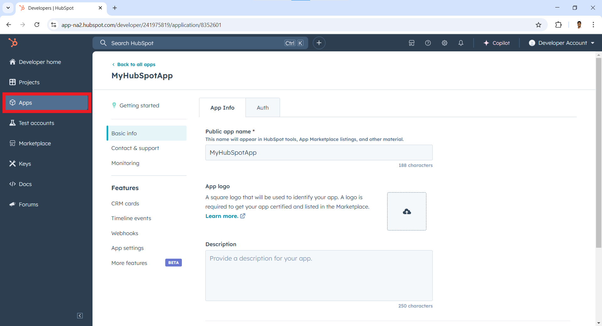

2. Obtain the App ID.
  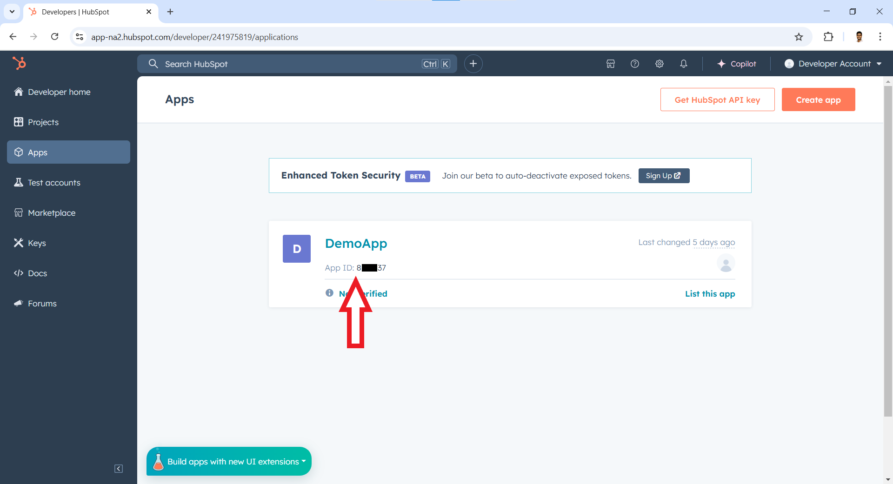

### Step 6: Get your Developer API key

1. Click on "Keys" section on the left sidebar and then on "Developer API Key".
  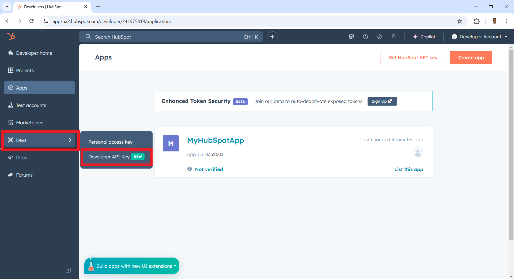

2. Click on "Create Key".
  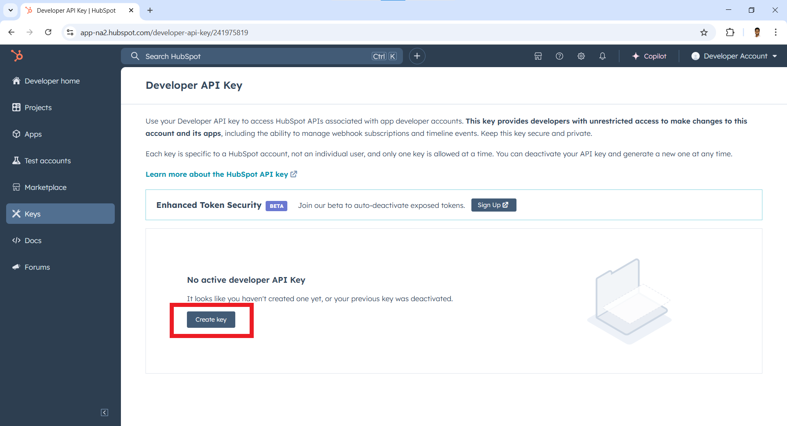

3. Click on "Show".
  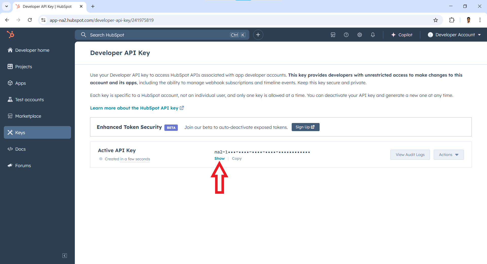

4. Click on "Copy" to obtain the developer API key.
  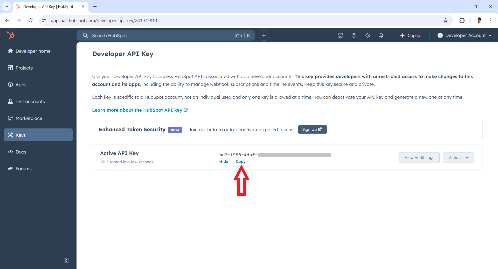

**Store the App ID (obtained in Step 4) and Developer API Key (Obtained in Step 5) securely for use in your application.**

## Quickstart

To use the `HubSpot CRM Video conference connector` in your Ballerina application, update the `.bal` file as follows:

### Step 1: Import the module

Import the `hubspot.crm.extensions.videoconferencing` module.

```ballerina
import ballerinax/hubspot.crm.extensions.videoconferencing as hsvideoconferencing;
```

### Step 2: Instantiate a new connector

1. Add these configurable and final variables in your `.bal` file.

   ```ballerina
   configurable string hapikey = ?;
   configurable int appId = ?;

   final int:Signed32 appIdSigned32 = <int:Signed32>appId;
   ```

2. Instantiate a `hsvideoconferencing:ApiKeysConfig` with the defined `hapikey` and initialize the connector with it.

   ```ballerina
   final hsvideoconferencing:ApiKeysConfig apiKeysConfig = {
      hapikey: hapikey
   };

   final hsvideoconferencing:Client hsVideoConferencing = check new (apiKeysConfig);
   ```

3. Create a `Config.toml` file and, configure the obtained credentials in the above steps as follows:

   ```toml
    hapikey = <Hubspot developer API key as a string>
    appId = <App ID as an int>
   ```

### Step 3: Invoke the connector operation

Now, utilize the available connector operations. A sample use case is shown below.

#### Create or update meeting settings

```ballerina
public function main() returns error? {
   hsvideoconferencing:ExternalSettings settings = {
      createMeetingUrl: "https://example.com/create-meeting",
      updateMeetingUrl: "https://example.com/update-meeting",
      deleteMeetingUrl: "https://example.com/delete-meeting",
      userVerifyUrl: "https://example.com/verify-user",
      fetchAccountsUri: "https://example.com/fetch-accounts"
   };

   hsvideoconferencing:ExternalSettings response = check hsVideoConferencing->/[appIdSigned32].put(settings);
}
```

#### Run the Ballerina application

```bash
bal run
```

## Examples

The `HubSpot CRM Video conference` connector provides practical examples illustrating usage in various scenarios. Explore these [examples](../examples/), covering the following use cases:

1. [Operate Conference Service](../examples/operate-conference-service/)
2. [Close Conference Service](../examples/close-conference-service/)
